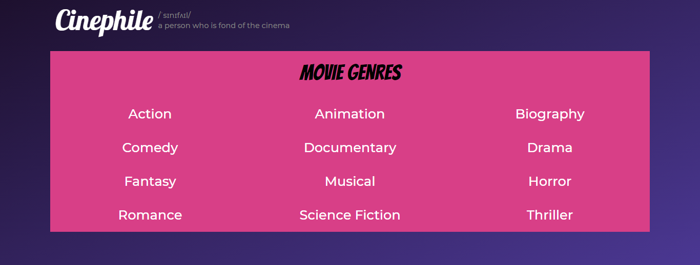
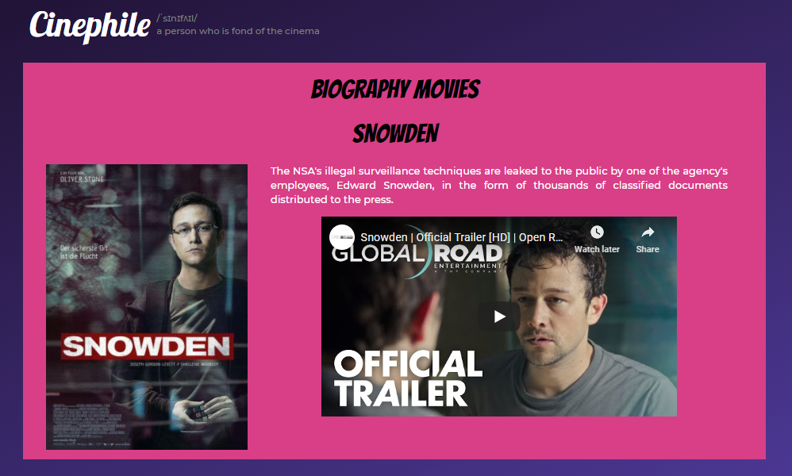

# Cinephile

This is a responsive **Single-Page Application (SPA)** that suggests movies for various movie genres. The user can learn more about the movie through an overview and a trailer.

The website is hosted on github pages at https://nouraneelwazane.github.io/Cinephile/

**DISCLAIMER: The movies' posters and overviews are from https://www.imdb.com/**

This is the home view where the user selects the movie genre they would like to take a look at.

Upon selecting the genre, a list of movies of that genre is displayed. The user can click on the movie poster to learn more about the movie or they can click on the Cinephile label to view other genres.

The movie's overview and trailer are provided. The user can go back to the movie genre's list by clicking the label above the movie name or they can go back to the home view by clicking on the Cinephile label.

